# Шаблон командного проєкту (Vite)

Цей шаблон створено на базі Vite та підготовлено для виконання командного
завдання на blended-заняттях. У ньому вже налаштована базова структура папок та
створені необхідні файли для послідовної командної роботи над проєктом.

## Створення репозиторію за шаблоном

Використовуй цей репозиторій організації GoIT як шаблон для створення
репозиторію свого проекту. Для цього натисни на кнопку `«Use this template»` і
обери опцію `«Create a new repository»`, як показано на зображенні.

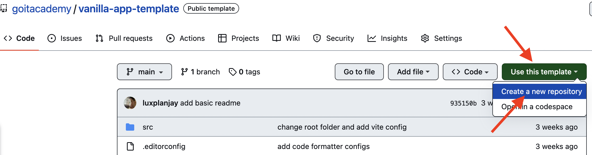

На наступному етапі відкриється сторінка створення нового репозиторію. Заповни
поле його імені, переконайся, що репозиторій публічний, після чого натисни
кнопку `«Create repository from template»`.

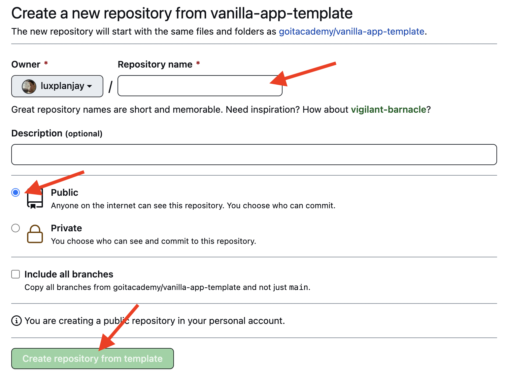

Після того, як репозиторій буде створено, необхідно перейти в налаштування
створеного репозиторію на вкладку `Settings` > `Actions` > `General` як показано
на зображенні.

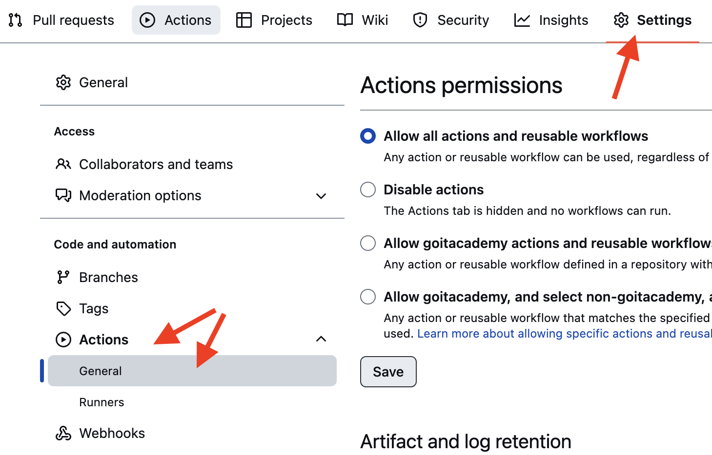

Проскроливши сторінку до самого кінця, в секції `«Workflow permissions»` обери
опцію `«Read and write permissions»` і постав галочку в чекбоксі. Це необхідно
для автоматизації процесу деплою проекту.

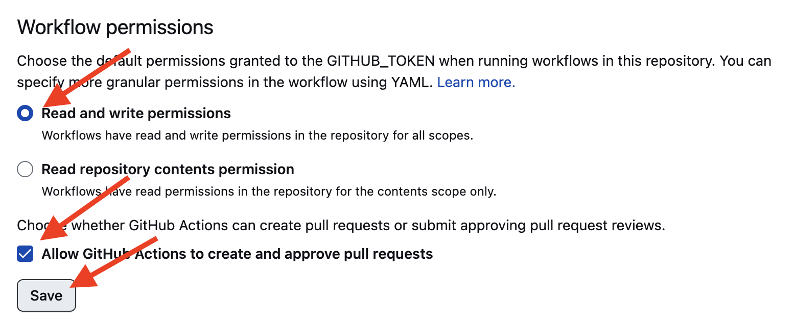

Тепер створено командний репозиторій зі структурою файлів і папок
репозиторію-шаблону. Його можна клонувати на комп’ютер, запускати локально,
створювати робочі гілки та надсилати зміни на GitHub через Pull Request.

## Деплой

Продакшн версія проекту буде автоматично збиратися та деплоїтись на GitHub
Pages, у гілку `gh-pages`, щоразу, коли оновлюється гілка `main`. Наприклад,
після прямого пуша або прийнятого пул-реквесту. Для цього необхідно у файлі
`package.json` змінити значення прапора
`--base=/js-blended-starter-mod-9-10/` для команди `build`, замінивши
`js-blended-starter-mod-9-10` на назву свого репозиторію, та відправити зміни на
GitHub.

```json
"build": "vite build --base=/js-blended-starter-mod-9-10/",
```

Відкриваємо на гітхабі файл package.json та натискаємо edit для внесення змін.
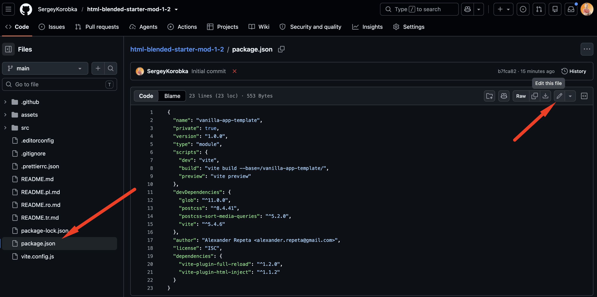

Замінюємо `js-blended-starter-mod-9-10` у значенні `--base` на назву свого
репозиторію. Назва в `--base` повинна повністю збігатися з назвою репозиторію
на GitHub.
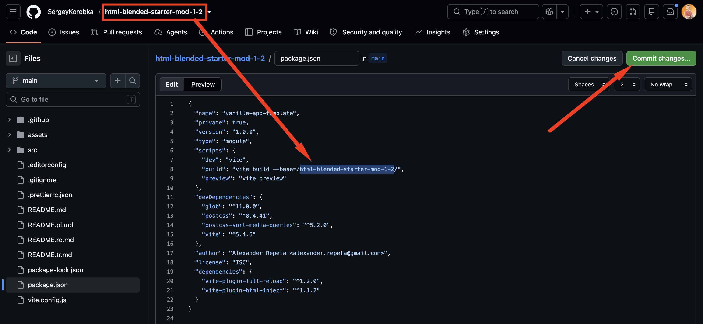

Далі необхідно зайти в налаштування GitHub-репозиторію (`Settings` > `Pages`) та
виставити роздачу продакшн версії файлів з папки `/ (root)` гілки `gh-pages`,
якщо це не було зроблено автоматично.

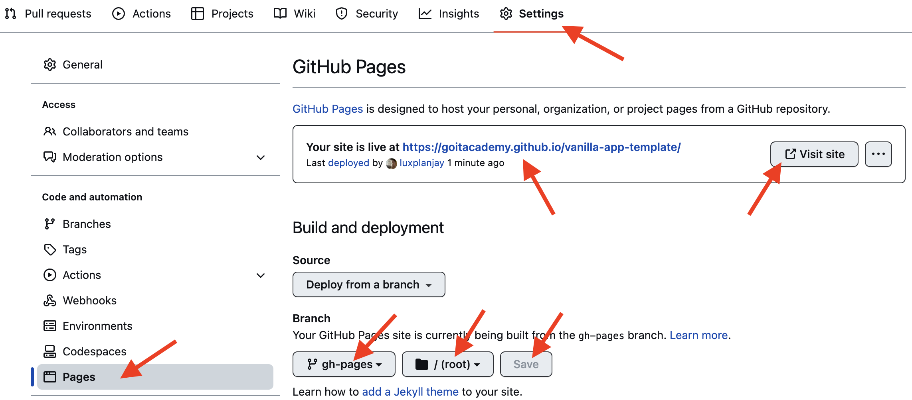

## Додавання учасників до проєкту

Після завершення всіх налаштувань необхідно додати всіх учасників команди до
репозиторію.

Кожен учасник отримає права на створення власних гілок, виконання комітів та
створення Pull Request.

Для цього перейдіть у налаштування репозиторію на вкладку `Settings` →
`Collaborators`, натисніть кнопку `Add people`, як показано на зображенні, та в
полі пошуку введіть email або nickname користувача, якого потрібно запросити.

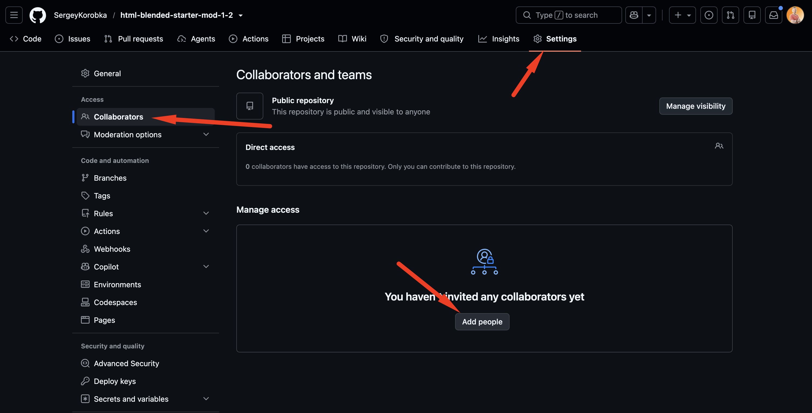

Після надсилання запрошення учасник отримає його електронною поштою або в
розділі повідомлень GitHub. Щоб отримати доступ до репозиторію, необхідно
прийняти це запрошення (`Accept invitation`).

## Підготовка до роботи

1. Переконайся, що на комп'ютері встановлено LTS-версію Node.js.
   [Скачай та встанови](https://nodejs.org/en/) її якщо необхідно.
2. Встанови базові залежності проекту в терміналі командою `npm install`.
3. Запусти режим розробки, виконавши в терміналі команду `npm run dev`.
4. Перейдіть у браузері за адресою
   [http://localhost:5173](http://localhost:5173). Ця сторінка буде автоматично
   перезавантажуватись після збереження змін у файли проекту.

## Файли і папки

Стартовий шаблон містить готову розмітку, стилі та підключений файл
`src/main.js`:

```text
src/
├── css/
│   ├── main.css
│   ├── common.css
│   ├── header.css
│   ├── control-panel.css
│   └── orders.css
├── js/
│   ├── storage.js
│   ├── render-orders.js
│   ├── countdown.js
│   ├── check-order.js
│   └── send-orders.js
├── partials/
│   ├── header.html
│   ├── control-panel.html
│   └── orders.html
├── index.html
└── main.js
```

Файл `src/index.html` збирає сторінку з окремих HTML-частин у папці
`src/partials`. Файл `src/css/main.css` підключає всі стилі з папки `src/css`.
Файл `src/main.js` лише підключає файли через імпорти `import './js/file.js'` і
не містить логіки або викликів функцій. Змінювати його не потрібно. Кожен
робочий модуль сам імпортує потрібні сутності з попередніх файлів і сам запускає
власні функції.

Кожен драйвер працює лише у своєму модулі:

1. `src/js/storage.js`;
2. `src/js/render-orders.js`;
3. `src/js/countdown.js`;
4. `src/js/check-order.js`;
5. `src/js/send-orders.js`.

## Робота з гілками

1. Перед початком роботи необхідно створити окрему гілку. Для цього виконайте в
   терміналі команду: `git switch -c назва_гілки` Назва гілки повинна
   відповідати задачі, над якою ви працюєте.
2. Виконайте свою частину завдання.
3. Після завершення роботи збережіть зміни та відправте їх до свого репозиторію,
   виконавши послідовно такі команди: `git add --all`
   `git commit -m "Completed назва_гілки"` `git push -u origin назва_гілки`
4. Після відправлення гілки на GitHub необхідно створити **Pull Request** та
   об'єднати свої зміни з гілкою `main`. Для цього виконайте наступні кроки:
   Перейдіть на вкладку `Pull requests` та натисніть кнопку `New pull request`.
   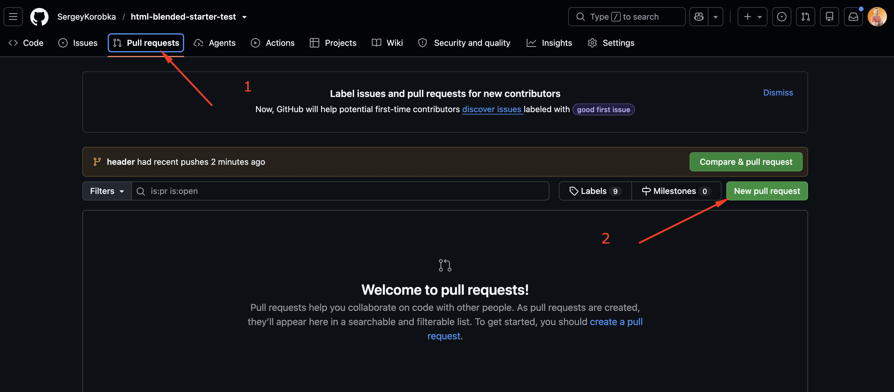

   У списку гілок оберіть:
   - ліворуч — гілку `main`;
   - праворуч — свою робочу гілку. Після цього натисніть кнопку
     `Create pull request`. 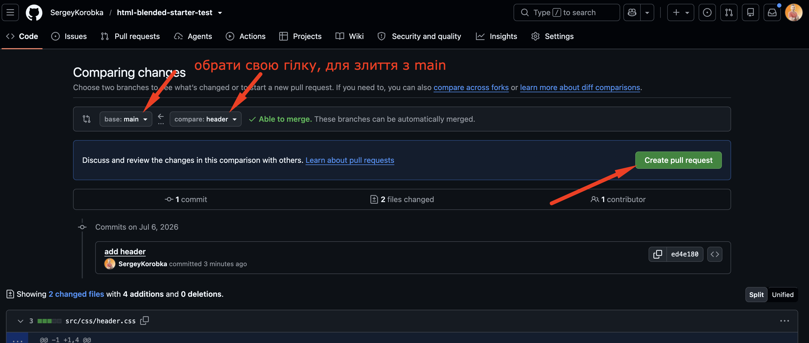

   За потреби змініть назву Pull Request або додайте його опис, після чого
   натисніть `Create pull request`. 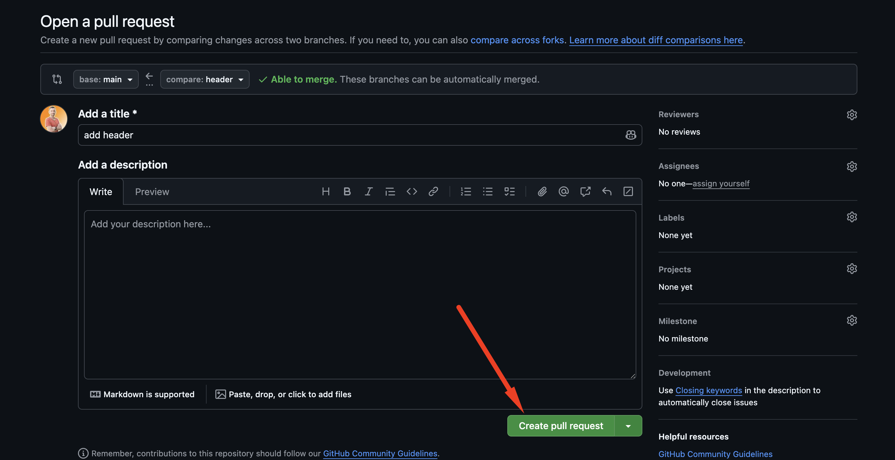

   Натисніть кнопку `Merge pull request`. 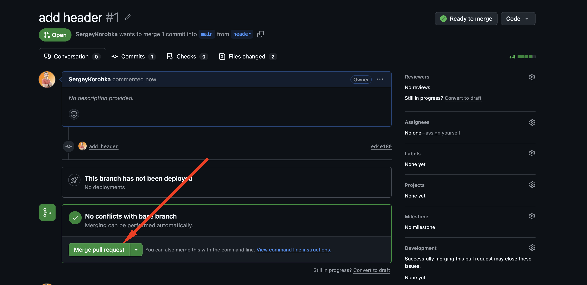

   Підтвердіть злиття, натиснувши `Confirm merge`.
   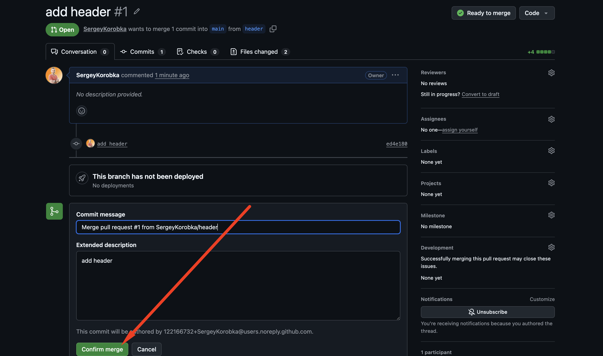

   Після успішного злиття Pull Request ваші зміни будуть додані до гілки `main`.
   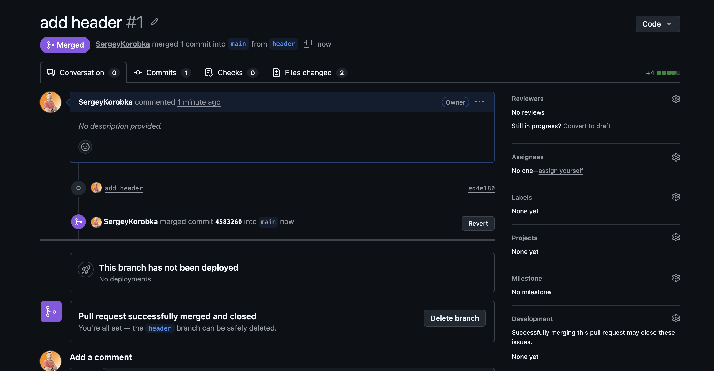

## Початок роботи наступного драйвера

Після об’єднання Pull Request новий драйвер повинен перевірити, у якій гілці він
знаходиться:

```bash
git branch
```

Якщо відкрита інша гілка, потрібно перейти в `main`:

```bash
git switch main
```

Після цього необхідно отримати зміни, які вже були додані попереднім учасником:

```bash
git pull
```

Лише після успішного оновлення `main` можна створити нову робочу гілку:

```bash
git switch -c назва_нової_гілки
```

Поки поточний драйвер працює, інші учасники не вносять зміни у свої локальні
файли та не надсилають паралельні зміни. Наступний етап починається лише після
об’єднання попереднього Pull Request із `main`.
